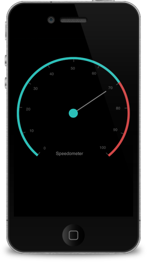
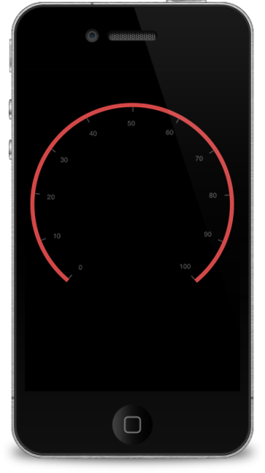

# Getting Started

## Create your first Circular Gauge in Xamarin.iOS

Essential Gauge for Xamarin.iOS allows you to visualize numeric values over a circular scale. The appearance of the gauge can be fully customized to seamlessly integrate with your applications.
This section provides a quick overview for working with Essential Gauge for Xamarin.iOS. It walks through the entire process of creating a real world gauge.

               

CircularGauge
{:.caption}

###Reference Essential Studio Components in your Solution

After installing Essential Studio for Xamarin, you can find all the required assemblies in the installation folders, typically:
{Syncfusion Installed location}\Essential Studio{version number}\lib

NOTE
Assemblies are available in unzipped package location in Mac.

You have to add the following assembly reference to the iOS unified project
ios-unifed \ Syncfusion.SfGauge.iOS.dll

### Initialize the CircularGauge

Create a CircularGauge object in the View Controller and add CircularGauge as subview.
You can create a CircularGauge object by using the following code example.


[C#]   

SFCircularGauge gauge = new SFCircularGauge ();
this.AddSubview (gauge);
            this.control = gauge;
	  


### Insert a Scale to the Gauge

Next, add one of more scales.

 
[C#]
    gauge = new SFCircularGauge ();
            scale = new SFCircularScale ();
            NSMutableArray scales = new NSMutableArray();
            scale = new SFCircularScale();
            scale.StartValue = 0;
            scale.EndValue = 100;
            scale.Interval = 10;
            scale.StartAngle = 40;
            scale.SweepAngle = 320;
            scale.RimWidth = 6;
            scale.ShowTicks = true;
            scale.ShowLabels = true;
            scale.RimColor = UIColor.FromRGB((byte)209,(byte)70,(byte)70);
            scale.LabelColor = UIColor.Gray;
            scale.LabelOffset = 0.1f;
            scale.MinorTicksPerInterval = 0;
scales.Add(scale);
gauge.Scales = scales;
this.AddSubview (gauge);
            this.control = gauge;



The following screenshot illustrates the output of the above code.

         

Added scale to the Gauge
{:.caption}

### Customize the ticks 

You can customize the major and minor ticks using the Tick settings as follows.


[C#]
              gauge = new SFCircularGauge ();
            scale = new SFCircularScale ();

            NSMutableArray scales = new NSMutableArray();
            scale = new SFCircularScale();
            scale.StartValue = 0;
            scale.EndValue = 100;
            scale.Interval = 10;
            scale.StartAngle = 40;
            scale.SweepAngle = 320;
            scale.RimWidth = 6;
            scale.ShowTicks = true;
            scale.ShowLabels = true;
            scale.RimColor = UIColor.FromRGB((byte)209,(byte)70,(byte)70);
            scale.LabelColor = UIColor.Gray;
            scale.LabelOffset = 0.1f;
            scale.MinorTicksPerInterval = 0;
           //Add minor Tick settings
            SFTickSettings minor = new SFTickSettings();
            minor.Size = 4;
            minor.Color = UIColor.FromRGB(68, 68, 68);
            minor.Width = 3;
            scale.MinorTickSettings = minor;
            //Add major Tick settings
            SFTickSettings major = new SFTickSettings();
            major.Size = 12;
            major.Offset = 0.041f;
            major.Color = UIColor.FromRGB(68,68,68);
            major.Width = 1.5f;
            scale.MajorTickSettings = major;
                scales.Add(scale);
            gauge.Scales = scales;
this.AddSubview (gauge);
            this.control = gauge;
		


The following screenshot illustrates the output of the above code.

          

Tick Customization
{:.caption}

### Add Pointers to the Scale

Now, add needle pointer and range pointer and associate it with a scale.


[C#]

gauge = new SFCircularGauge ();
            scale = new SFCircularScale ();
            NSMutableArray scales = new NSMutableArray();
            scale = new SFCircularScale();
            scale.StartValue = 0;
            scale.EndValue = 100;
            scale.Interval = 10;
            scale.StartAngle = 40;
            scale.SweepAngle = 320;
            scale.RimWidth = 6;
            scale.ShowTicks = true;
            scale.ShowLabels = true;
            scale.RimColor = UIColor.FromRGB((byte)209,(byte)70,(byte)70);
            scale.LabelColor = UIColor.Gray;
            scale.LabelOffset = 0.1f;
            scale.MinorTicksPerInterval = 0;
            NSMutableArray pointers = new NSMutableArray();
            needlePointer = new SFNeedlePointer();
            needlePointer.Value = 70;
            needlePointer.Color = UIColor.Gray;
            needlePointer.KnobRadius = 12;
            needlePointer.KnobColor = UIColor.FromRGB(43, 191, 184);
            needlePointer.Width = 3;
            needlePointer.LengthFactor =nfloat.Parse("0.7");  
          rangePointer = new SFRangePointer();
            rangePointer.Value = 70;
            rangePointer.Color = UIColor.FromRGB(43, 191, 184);
            rangePointer.Width = 6;
            pointers.Add(needlePointer);
            pointers.Add(rangePointer);
            //Add minor Tick settings
            SFTickSettings minor = new SFTickSettings();
            minor.Size = 4;
            minor.Color = UIColor.FromRGB(68, 68, 68);
            minor.Width = 3;
            scale.MinorTickSettings = minor;
            //Add major Tick settings
            SFTickSettings major = new SFTickSettings();
            major.Size = 12;
            major.Offset = 0.041f;
            major.Color = UIColor.FromRGB(68,68,68);
            major.Width = 1.5f;
            scale.MajorTickSettings = major;
            scale.Pointers = pointers;
            scales.Add(scale);
            gauge.Scales = scales;
this.AddSubview (gauge);
            this.control = gauge;



The following screenshot illustrates the output of the above code.

                        

Added pointers to the Gauge
{:.caption}

### Add Header to the Gauge

You can add custom labels in the gauge and position it.


[C#]

             gauge = new SFCircularGauge ();
            scale = new SFCircularScale ();
            NSMutableArray scales = new NSMutableArray();
            scale = new SFCircularScale();
            scale.StartValue = 0;
            scale.EndValue = 100;
            scale.Interval = 10;
            scale.StartAngle = 40;
            scale.SweepAngle = 320;
            scale.RimWidth = 6;
            scale.ShowTicks = true;
            scale.ShowLabels = true;
            scale.RimColor = UIColor.FromRGB((byte)209,(byte)70,(byte)70);
            scale.LabelColor = UIColor.Gray;
            scale.LabelOffset = 0.1f;
            scale.MinorTicksPerInterval = 0;
            NSMutableArray pointers = new NSMutableArray();
            needlePointer = new SFNeedlePointer();
            needlePointer.Value = 70;
            needlePointer.Color = UIColor.Gray;
            needlePointer.KnobRadius = 12;
            needlePointer.KnobColor = UIColor.FromRGB(43, 191, 184);
            needlePointer.Width = 3;
            needlePointer.LengthFactor =nfloat.Parse("0.7");  
          rangePointer = new SFRangePointer();
            rangePointer.Value = 70;
            rangePointer.Color = UIColor.FromRGB(43, 191, 184);
            rangePointer.Width = 6;
            pointers.Add(needlePointer);
            pointers.Add(rangePointer);
            //Add minor Tick settings
            SFTickSettings minor = new SFTickSettings();
            minor.Size = 4;
            minor.Color = UIColor.FromRGB(68, 68, 68);
            minor.Width = 3;
            scale.MinorTickSettings = minor;
            //Add major Tick settings
            SFTickSettings major = new SFTickSettings();
            major.Size = 12;
            major.Offset = 0.041f;
            major.Color = UIColor.FromRGB(68,68,68);
            major.Width = 1.5f;
            scale.MajorTickSettings = major;
            scale.Pointers = pointers;
            scales.Add(scale);
            gauge.Scales = scales;
SFGaugeHeader header = new SFGaugeHeader();
            header.Text = (NSString)"Speedometer";
            header.Position = new CGPoint (0.4f, 0.7f);
            header.TextColor = UIColor.Gray;
            gauge.Headers.Add(header);
this.AddSubview (gauge);
            this.control = gauge;



The following screenshot illustrates the output of the above code.

             

Added Header to the Gauge
{:.caption}

