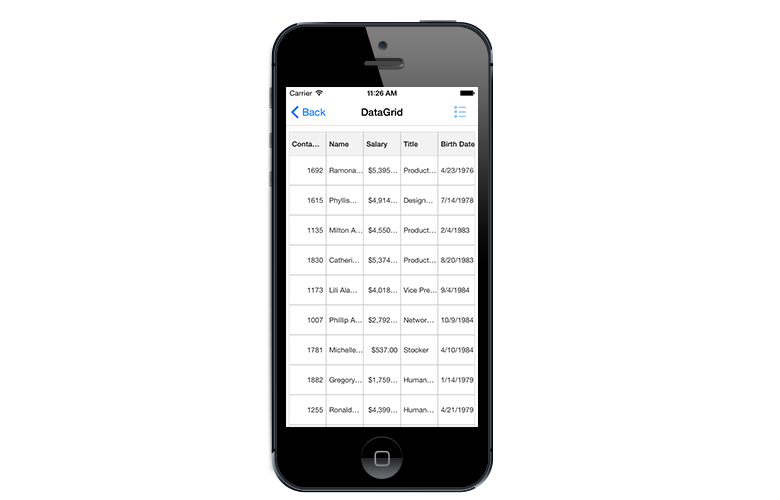
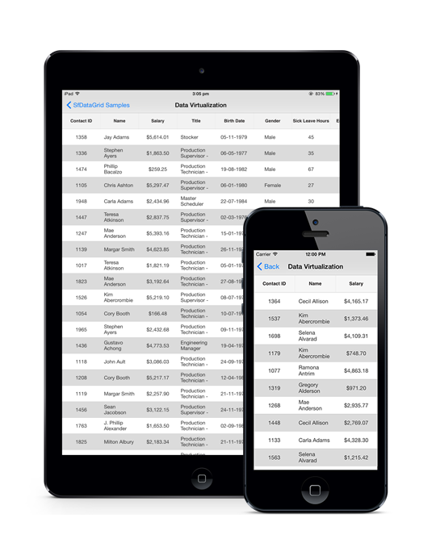
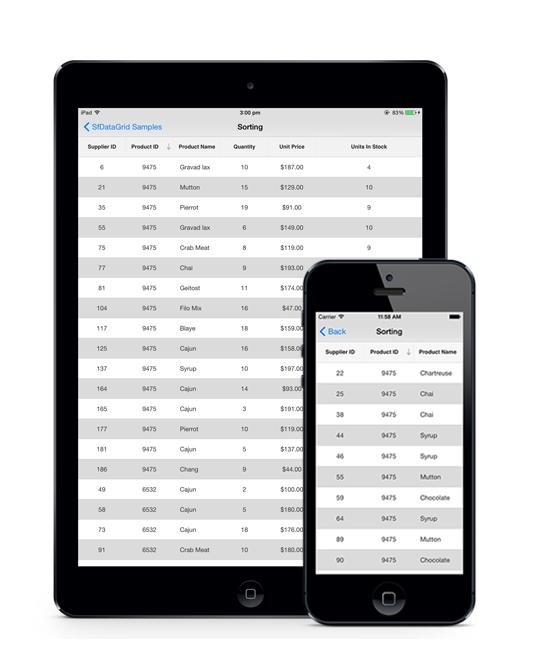
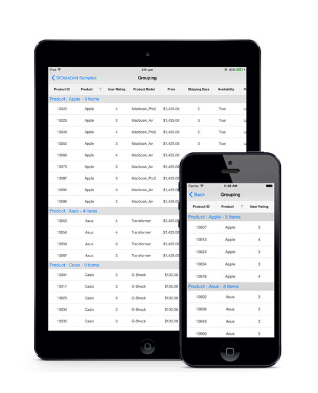

# Getting Started

This section provides a quick overview for working with SfDataGrid for Xamarin.iOS. You will walk through the entire process of creating a real world SfDataGrid.

## Assembly deployment

After installing Essential Studio for Xamarin, you can find all the required assemblies in the installation folders,

{Syncfusion Essential Studio Installed location}\Essential Studio\{{ site.releaseversion }}\Xamarin\lib

Eg: C:\Program Files (x86)\Syncfusion\Essential Studio\{{ site.releaseversion }}\Xamarin\lib

N> Assemblies can be found in unzipped package location in Mac

### SfDataGrid Xamarin.iOS

The following list of assemblies need to be added as reference from the lib folder to use SfDataGrid in your application.

<table>
<tr>
<th>Project</th>
<th>Required assemblies</th>
</tr>
<tr>
<td>Xamarin.iOS</td>
<td>Syncfusion.Linq.iOS.dll Syncfusion.SfDataGrid.iOS.dll Syncfusion.GridCommon.Portable.dll Syncfusion.SfNumericTextBox.iOS.dll </td>
</tr>
</table>

In order to use export to excel and export to PDF functionalities of SfDataGrid, add the below assembly to your project.

<table>
<tr>
<th>Project</th>
<th>Required assemblies</th>
</tr>
<tr>
<td>Xamarin.iOS</td>
<td>Syncfusion.SfGridConverter.iOS.dll pcl\Syncfusion.Compression.Portable.dll pcl\Syncfusion.Pdf.Portable.dll pcl\Syncfusion.XlsIO.Portable.dll </td>
</tr>
</table>

## Create a simple SfDataGrid 

This section explains how to create a SfDataGrid and configure it. The SfDataGrid control can be configured entirely in C# code. This is how the final output will look like on iOS devices.
 

 
You can download the entire source code of this demo for Xamarin.iOS from [here](http://files2.syncfusion.com/Xamarin.iOS/Samples/DataGrid_GettingStartediOS.zip). 

In this walk through, you will create a new application that contains the SfDataGrid which includes the below topics.

* [Creating the project](#creating-the-project) 
* [Adding SfDataGrid in Xamarin.iOS](#adding-sfdatagrid-in-xamarinios)
* [Create data model](#create-datamodel-for-the-sfdatagrid)  
* [Binding data](#binding-data-to-sfdatagrid) 
* [Defining columns](#defining-columns) 
* [Sorting](#sorting) 
* [Grouping](#grouping) 
* [Selection](#selection)

## Creating the project

Create a new iOS application in Xamarin Studio or Visual Studio for Xamarin.iOS.

## Adding SfDataGrid in Xamarin.iOS

1. Add the required assembly references to the project as discussed in the [Assembly deployment](#assembly-deployment) section.

2. Import SfDataGrid control namespace Syncfusion.SfDataGrid.

3. Create an instance of SfDataGrid control and add as a SubView to a UIViewController.


using Syncfusion.SfDataGrid; 
public partial class GettingStartedViewController : UIViewController
{
    SfDataGrid dataGrid;

    static bool UserInterfaceIdiomIsPhone {
        get { return UIDevice.CurrentDevice.UserInterfaceIdiom == UIUserInterfaceIdiom.Phone; }
    }

    public GettingStartedViewController ()
        : base (UserInterfaceIdiomIsPhone ? "GettingStartedViewController_iPhone" : "GettingStartedViewController_iPad", null)
    {
        dataGrid = new SfDataGrid ();
        dataGrid.HeaderRowHeight = 45;
        dataGrid.RowHeight = 45;
    }

    public override void ViewDidLoad ()
    {
        base.ViewDidLoad ();
        dataGrid.Frame = new CGRect (0, 0, View.Frame.Width, View.Frame.Height);
        View.AddSubview (dataGrid);
    }
}


Run the application to render the following output. 

The [Frame](https://developer.xamarin.com/api/property/UIKit.UIView.Frame/) is used to arrange a view in Xamarin.iOS. By default a view in Xamarin.iOS will be arranged without any padding from the title bar. Hence the content of the arranged view will overlap with the title bar if the top position of its `Frame` is set as `0`. 

To overcome the above problem, the top position of the view's `Frame` has to be customized accordingly to position the view below the title bar in iOS. Refer the below code example in which the top position of the SfDataGrid's `Frame` is set to 30 to overcome the problem.


public override void ViewDidLoad ()
{
      base.ViewDidLoad ();
      dataGrid.Frame = new CGRect (0, 30, View.Frame.Width, View.Frame.Height);
      View.AddSubview (dataGrid);
 }
 

 Run the application with the above code to render the following output. 

## Create DataModel for the SfDataGrid

SfDataGrid is a data-bound control. Hence you must create a data model to bind it to the control. 

Create a simple data source as shown in the following code example in a new class file and save it as OrderInfo.cs file. 


public class OrderInfo
{
    private int orderID;
    private string customerID;
    private string customer;
    private string shipCity;
    private string shipCountry;

    public int OrderID {
        get { return orderID; }
        set { this.orderID = value; }
    }

    public string CustomerID {
        get { return customerID; }
        set { this.customerID = value; }
    }

    public string ShipCountry {
        get { return shipCountry; }
        set { this.shipCountry = value; }
    }

    public string Customer {
        get { return this.customer; }
        set { this.customer = value; }
    }

    public string ShipCity {
        get { return shipCity; }
        set { this.shipCity = value; }
    }

    public OrderInfo (int orderId, string customerId, string country, string customer, string shipCity)
    {
        this.OrderID = orderId;
        this.CustomerID = customerId;
        this.Customer = customer;
        this.ShipCountry = country;
        this.ShipCity = shipCity;
    }
} 


N> If you want your data model to respond to property changes, then implement `INotifyPropertyChanged` interface in your model class

Create a model repository class with OrderInfo collection property initialized with required number of data objects in a new class file as shown in the following code example and save it as OrderInfoRepository.cs file.


public class OrderInfoRepository
{
    private ObservableCollection<OrderInfo> orderInfo;
    public ObservableCollection<OrderInfo> OrderInfoCollection {
        get { return orderInfo; }
        set { this.orderInfo = value; }
    }

    public OrderInfoRepository ()
    {
        orderInfo = new ObservableCollection<OrderInfo> ();
        this.GenerateOrders ();
    }

    private void GenerateOrders ()
    {
        orderInfo.Add (new OrderInfo (1001, "Maria Anders", "Germany", "ALFKI", "Berlin"));
        orderInfo.Add (new OrderInfo (1002, "Ana Trujillo", "Mexico", "ANATR", "Mexico D.F."));
        orderInfo.Add (new OrderInfo (1003, "Ant Fuller", "Mexico", "ANTON", "Mexico D.F."));
        orderInfo.Add (new OrderInfo (1004, "Thomas Hardy", "UK", "AROUT", "London"));
        orderInfo.Add (new OrderInfo (1005, "Tim Adams", "Sweden", "BERGS", "Lula"));
        orderInfo.Add (new OrderInfo (1006, "Hanna Moos", "Germany", "BLAUS", "Mannheim"));
        orderInfo.Add (new OrderInfo (1007, "Andrew Fuller", "France", "BLONP", "Strasbourg"));
        orderInfo.Add (new OrderInfo (1008, "Martin King", "Spain", "BOLID", "Madrid"));
        orderInfo.Add (new OrderInfo (1009, "Lenny Lin", "France", "BONAP", "Marseilles"));
        orderInfo.Add (new OrderInfo (1010, "John Carter", "Canada", "BOTTM", "Tsawassen"));
        orderInfo.Add (new OrderInfo (1011, "Martin King", "UK", "AROUT", "London"));
        orderInfo.Add (new OrderInfo (1012, "Anne Wilson", "Germany", "BLAUS", "Mannheim"));
        orderInfo.Add (new OrderInfo (1013, "Hanna Kyle", "France", "BLONP", "Strasbourg"));
        orderInfo.Add (new OrderInfo (1014, "Gina Irene", "UK", "AROUT", "London"));
    }
}


## Binding data to SfDataGrid

In order to bind the data source of the SfDataGrid, set the [SfDataGrid.ItemsSource](http://help.syncfusion.com/cr/cref_files/xamarin-ios/sfdatagrid/Syncfusion.SfDataGrid.iOS~Syncfusion.SfDataGrid.SfDataGrid~ItemsSource.html) property as shown below. You can bind the data source of the SfDataGrid as follows. 

The following code example binds the collection created in previous step to `SfDataGrid.ItemsSource` property.


OrderInfoRepository viewModel = new OrderInfoRepository ();
dataGrid.ItemsSource = viewModel.OrderInfoCollection; 


Now run the application to render the following output.

## Defining Columns

By default, the SfDataGrid automatically creates columns for all the properties in the data source. The type of the column generated depends on the type of data in the column. When the columns are auto-generated, you can handle the [SfDataGrid.AutoGeneratingColumn](http://help.syncfusion.com/cr/cref_files/xamarin-ios/sfdatagrid/Syncfusion.SfDataGrid.iOS~Syncfusion.SfDataGrid.SfDataGrid~AutoGeneratingColumn_EV.html) event to customize or cancel the columns before they are added to the Columns collection in SfDataGrid.
 
You can also define the columns manually by setting the [SfDataGrid.AutoGenerateColumns](http://help.syncfusion.com/cr/cref_files/xamarin-ios/sfdatagrid/Syncfusion.SfDataGrid.iOS~Syncfusion.SfDataGrid.SfDataGrid~AutoGenerateColumns.html) property to false and by adding the `GridColumn` objects to the [SfDataGrid.Columns](http://help.syncfusion.com/cr/cref_files/xamarin-ios/sfdatagrid/Syncfusion.SfDataGrid.iOS~Syncfusion.SfDataGrid.SfDataGrid~AutoGenerateColumns.html) collection. The following code example illustrates how this can be done. 


dataGrid.AutoGenerateColumns = false;

GridTextColumn orderIdColumn = new GridTextColumn ();
orderIdColumn.MappingName = "OrderID";
orderIdColumn.HeaderText = "Order ID";

GridTextColumn customerIdColumn = new GridTextColumn ();
customerIdColumn.MappingName = "CustomerID";
customerIdColumn.HeaderText = "Customer ID";

GridTextColumn customerColumn = new GridTextColumn ();
customerColumn.MappingName = "Customer";
customerColumn.HeaderText = "Customer";

GridTextColumn countryColumn = new GridTextColumn ();
countryColumn.MappingName = "ShipCountry";
countryColumn.HeaderText = "Ship Country";

dataGrid.Columns.Add (orderIdColumn);
dataGrid.Columns.Add (customerIdColumn);
dataGrid.Columns.Add (customerColumn);
dataGrid.Columns.Add (countryColumn); 


## Sorting

SfDataGrid allows you to apply sorting on its data by setting the [SfDataGrid.AllowSorting](http://help.syncfusion.com/cr/cref_files/xamarin-ios/sfdatagrid/Syncfusion.SfDataGrid.iOS~Syncfusion.SfDataGrid.SfDataGrid~AllowSorting.html) property to true.
 

dataGrid.AllowSorting = true; 


Run the application and touch the header cell to sort the data and the following output will be displayed.
 

You can also configure sorting by adding the column to the [SfDataGrid.SortColumnDescriptions](http://help.syncfusion.com/cr/cref_files/xamarin-ios/sfdatagrid/Syncfusion.SfDataGrid.iOS~Syncfusion.SfDataGrid.SfDataGrid~SortColumnDescriptions.html) collection as below.


dataGrid.SortColumnDescriptions.Add (new SortColumnDescription () { ColumnName = "CustomerID" });


## Grouping

SfDataGrid allows you to group a column by adding the column to the [SfDataGrid.GroupColumnDescriptions](http://help.syncfusion.com/cr/cref_files/xamarin-ios/sfdatagrid/Syncfusion.SfDataGrid.iOS~Syncfusion.SfDataGrid.SfDataGrid~SortColumnDescriptions.html) collection as shown below.


dataGrid.GroupColumnDescriptions.Add (new GroupColumnDescription () { ColumnName = "ShipCountry" });


Run the application to render the following output. 

## Selection

SfDataGrid allows you to select the row/rows by setting the [SfDataGrid.SelectionMode](http://help.syncfusion.com/cr/cref_files/xamarin-ios/sfdatagrid/Syncfusion.SfDataGrid.iOS~Syncfusion.SfDataGrid.SfDataGrid~SelectionMode.html) property. You can set the `SfDataGrid.SelectionMode` property to single, multiple, single deselect or none based on your requirements. Information about the row/rows selected can be tracked using [SfDataGrid.SelectedItem](http://help.syncfusion.com/cr/cref_files/xamarin-ios/sfdatagrid/Syncfusion.SfDataGrid.iOS~Syncfusion.SfDataGrid.SfDataGrid~SelectedItem.html) and [SfDataGrid.SelectedItems](http://help.syncfusion.com/cr/cref_files/xamarin-ios/sfdatagrid/Syncfusion.SfDataGrid.iOS~Syncfusion.SfDataGrid.SfDataGrid~SelectedItems.html) properties.

You can handle the selection operations with the help of [SelectionChanging](http://help.syncfusion.com/cr/cref_files/xamarin-ios/sfdatagrid/Syncfusion.SfDataGrid.iOS~Syncfusion.SfDataGrid.SfDataGrid~SelectionChanging_EV.html) and [SelectionChanged](http://help.syncfusion.com/cr/cref_files/xamarin-ios/sfdatagrid/Syncfusion.SfDataGrid.iOS~Syncfusion.SfDataGrid.SfDataGrid~SelectionChanged_EV.html) events.

## Loading SfDataGrid with specified height and width

SfDataGrid can be loaded with specific height and width by specifying the height and width of the `SfDataGrid.Frame` property.

To load SfDataGrid with specific height and width, follow the code example:


public override void ViewDidLayoutSubviews()
{
    dataGrid.Frame = new CGRect(85, 130, 200, 380);
    base.ViewDidLayoutSubviews();
}


The following screenshot shows how the SfDataGrid is loaded with specific height and width: 

