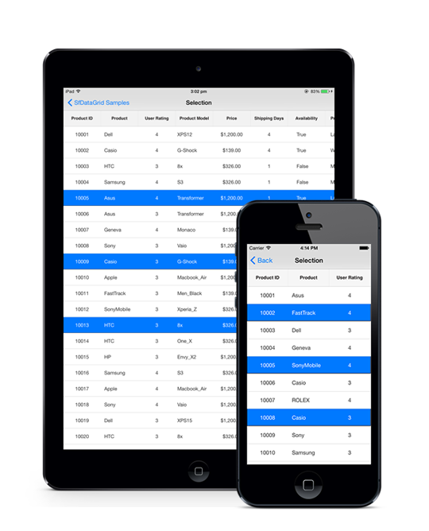

# Selection

This section explains how to enable selection in the SfDataGrid and about the selection modes, properties, events that involves in selection and customizations available for selection.

The SfDataGrid selects a specific row or group of rows either programmatically or by touch interactions. To enable selection in the SfDataGrid, set the [SfDataGrid.SelectionMode](http://help.syncfusion.com/cr/cref_files/xamarin-ios/sfdatagrid/Syncfusion.SfDataGrid.iOS~Syncfusion.SfDataGrid.SfDataGrid~SelectionMode.html) property to a value other than `None`. The SfDataGrid has different selection modes as listed as follows:

## Selection modes 
<table>
<tr>
<th> Modes </th>
<th> Description </th>
</tr>
<tr>
<td> {{'[None](http://help.syncfusion.com/cr/cref_files/xamarin-ios/sfdatagrid/Syncfusion.SfDataGrid.iOS~Syncfusion.SfDataGrid.SelectionMode.html)'| markdownify }} </td>
<td>Disables selection and no rows can be selected. This is the default value.</td>
</tr>
<tr>
<td> {{'[Single](http://help.syncfusion.com/cr/cref_files/xamarin-ios/sfdatagrid/Syncfusion.SfDataGrid.iOS~Syncfusion.SfDataGrid.SelectionMode.html)'| markdownify }} </td>
<td> Allows selecting a single row. Upon selecting the next row, the selection in the previous row is cleared. </td>
</tr>
<tr>
<td> {{'[Multiple](http://help.syncfusion.com/cr/cref_files/xamarin-ios/sfdatagrid/Syncfusion.SfDataGrid.iOS~Syncfusion.SfDataGrid.SelectionMode.html)'| markdownify }}  </td>
<td> Allows selecting more than one row. Selection is not cleared when selecting more than one record. When clicking on a selected row for the second time, selection is cleared. </td>
</tr>
<tr>
<td>  {{'[SingleDeselect](http://help.syncfusion.com/cr/cref_files/xamarin-ios/sfdatagrid/Syncfusion.SfDataGrid.iOS~Syncfusion.SfDataGrid.SelectionMode.html)'| markdownify }}  </td>
<td> Allows selecting only a single row: however tapping the row adjacent to the selection is cleared. Similar to single mode, upon selecting the next row the selection in the previous row is cleared. </td>
</tr>
</table>

The following code example illustrates how to set the selection mode in the SfDataGrid.


dataGrid.SelectionMode = SelectionMode.Multiple; 


The following screenshot shows the selection functionality in SfDataGrid.

## Programmatic selection

When the `SfDataGrid.SelectionMode` is `None`, you can also select the row or rows in the SfDataGrid from the code by setting the [SfDataGrid.SelectedIndex](http://help.syncfusion.com/cr/cref_files/xamarin-ios/sfdatagrid/Syncfusion.SfDataGrid.iOS~Syncfusion.SfDataGrid.SfDataGrid~SelectedIndex.html), [SfDataGrid.SelectedItem](http://help.syncfusion.com/cr/cref_files/xamarin-ios/sfdatagrid/Syncfusion.SfDataGrid.iOS~Syncfusion.SfDataGrid.SfDataGrid~SelectedItem.html), or [SfDataGrid.SelectedItems](http://help.syncfusion.com/cr/cref_files/xamarin-ios/sfdatagrid/Syncfusion.SfDataGrid.iOS~Syncfusion.SfDataGrid.SfDataGrid~SelectedItems.html) property based on the selection mode. The following code example illustrates how to enable selection from code.

When the selection mode is `Single`, you can programmatically select a row in two ways: by setting the row index to the `SfDataGrid.SelectedIndex` property, or by setting the underlying object to be selected to the `SfDataGrid.SelectedItem` property. 

The following code example illustrates how to programmatically select a row from the code.


//Perform selection using selected index
dataGrid.SelectedIndex = 3;
 
//Perform selection using selected item
dataGrid.SelectedItem = viewModel.OrdersInfo [5];


When the selection mode is Multiple you can programmatically select more than one row by adding the underlying object to be selected to the `SfDataGrid.SelectedItems` property. 

The following code example illustrates how to programmatically select more than one row from the code.

 
//Perform multiple selection using selected item
dataGrid.SelectedItems.Add (viewModel.OrdersInfo [4]);
dataGrid.SelectedItems.Add (viewModel.OrdersInfo [5]);


### CurrentItem

The [SfDataGrid.CurrentItem](http://help.syncfusion.com/cr/cref_files/xamarin-ios/sfdatagrid/Syncfusion.SfDataGrid.iOS~Syncfusion.SfDataGrid.SfDataGrid~CurrentItem.html) property holds the underlying data of the last selected row in the SfDataGrid. 

You can get the current item in the `SfDataGrid.SelectionChanged` event by setting the `SfDataGrid.SelectionMode` as `Multiple` or `SingleDeselect`. If the `SelectionMode` is `Single`, currentItem and selectedItem are same.

The following code example illustrates how to set the selection mode for the SfDataGrid in the `SelectionChanged` event.


dataGrid.SelectionMode = SelectionMode.Multiple; 
 
dataGrid.SelectionChanged += DataGrid_SelectionChanged; 
 
void DataGrid_SelectionChanged (object sender, GridSelectionChangedEventArgs e) 
{ 
 var currentItem = dataGrid.CurrentItem; 

 //your codes
} 


## Selection events

The SfDataGrid provides the following events for selection:

* [SfDataGrid.SelectionChanging](http://help.syncfusion.com/cr/cref_files/xamarin-ios/sfdatagrid/Syncfusion.SfDataGrid.iOS~Syncfusion.SfDataGrid.SfDataGrid~SelectionChanging_EV.html): Raised while selecting a row at the execution time before the row is selected. So, it allows canceling selection action by setting the Cancel property of [GridSelectionChangingEventArgs](http://help.syncfusion.com/cr/cref_files/xamarin-ios/sfdatagrid/Syncfusion.SfDataGrid.iOS~Syncfusion.SfDataGrid.GridSelectionChangingEventArgs.html).
* [SelectionChanged](http://help.syncfusion.com/cr/cref_files/xamarin-ios/sfdatagrid/Syncfusion.SfDataGrid.iOS~Syncfusion.SfDataGrid.SfDataGrid~SelectionChanged_EV.html): Raised after the column is selected.

These two events are triggered with `GridSelectionChangingEventArgs` and [GridSelectionChangedEventArgs](http://help.syncfusion.com/cr/cref_files/xamarin-ios/sfdatagrid/Syncfusion.SfDataGrid.iOS~Syncfusion.SfDataGrid.GridSelectionChangedEventArgs.html) that contains the following properties.

* [AddedItems](http://help.syncfusion.com/cr/cref_files/xamarin-ios/sfdatagrid/Syncfusion.SfDataGrid.iOS~Syncfusion.SfDataGrid.GridSelectionChangedEventArgs~AddedItems.html): Gets the collection of underlying data objects added to selection.
* [RemovedItems](http://help.syncfusion.com/cr/cref_files/xamarin-ios/sfdatagrid/Syncfusion.SfDataGrid.iOS~Syncfusion.SfDataGrid.GridSelectionChangedEventArgs~RemovedItems.html): Gets the collection of underlying data objects removed from selection.

The following code example illustrates how to hook the `SfDataGrid.SelectionChanging` event and cancel the selection of a column.


dataGrid.SelectionChanging += DataGrid_SelectionChanging;  

void DataGrid_SelectionChanging (object sender, GridSelectionChangingEventArgs e)
{
    e.Cancel = true;
}


The following code explains how to get the selected item in code-behind, by making use of the `SfDataGrid.SelectionChanged` event.


dataGrid.SelectionChanged += DataGrid_SelectionChanged;

private void DataGrid_SelectionChanged (object sender, GridSelectionChangedEventArgs e)
{
    // Gets the selected item.
    var selectedItems = e.AddedItems[0];
}


## Row header sSelection

The SfDataGrid selects the grid row(s) upon tapping them over the grid cells. It also allows selecting the grid rows when tapping the row header cells. To enable selection in the SfDataGrid, set the `SfDataGrid.SelectionMode` property to `None`.

### Select records in the SfDataGrid when tapping only on the row header cells

The SfDataGrid allows selecting a specific row or group of rows by touching the grid cells. However, to select the record only when tapping on the row header cells, use the `SfDataGrid.SelectionChanging` event. 
 
The following code example illustrates how to select records in the SfDataGrid when tapping only on the row header cells.



dataGrid.SelectionMode = SelectionMode.Single;

private void DataGrid_SelectionChanging(object sender, GridSelectionChangingEventArgs e)
{
    e.Cancel = true;
}

private void DataGrid_GridTapped(object sender, GridTappedEventsArgs e)
{
    if(e.RowColumnIndex.ColumnIndex == 0)
    {
        dataGrid.SelectedIndex = e.RowColumnIndex.RowIndex;
    }
}
 


N> To enable the row header in SfDataGrid, the `SfDataGrid.ShowRowHeader` to `true`.

## Clear selection

The SfDataGrid allows clearing the selection applied in the grid rows in two ways: by setting the `SfDataGrid.SelectionMode` to `None`, or by calling the [SfDataGrid.SelectionController.ClearSelection ()](http://help.syncfusion.com/cr/cref_files/xamarin/sfdatagrid/Syncfusion.SfDataGrid.XForms~Syncfusion.SfDataGrid.XForms.GridSelectionController~ClearSelection.html) method.

The following code example illustrates how to clear selection in the SfDataGrid.


//Clear selection using selection mode
dataGrid.SelectionMode = SelectionMode.None;

//Clear selection using selection controller
dataGrid.SelectionController.ClearSelection (); 


N> Selected items and the selections will be cleared whenever the ItemsSource is changed at runtime.

## Multiple selection colors

The SfDataGrid supports selecting one or more rows either programmatically or by touch interactions. By default, the SfDataGrid applies a common background color for the selected rows based on the current theme. However, it also provides extensibility to have multiple selection colors when touching the rows by writing a custom SelectionController derived from [GridSelectionController](http://help.syncfusion.com/cr/cref_files/xamarin-ios/sfdatagrid/Syncfusion.SfDataGrid.iOS~Syncfusion.SfDataGrid.GridSelectionController.html) and assigning it to the [SfDataGrid.SelectionController](http://help.syncfusion.com/cr/cref_files/xamarin-ios/sfdatagrid/Syncfusion.SfDataGrid.iOS~Syncfusion.SfDataGrid.SfDataGrid~SelectionController.html) property. Override the GetSelectionColor() method to apply different colors for selection at runtime.

The following code example illustrates how to set different colors for the selected rows in the SfDataGrid.


sfGrid.SelectionController = new CustomSelectionController(sfGrid);
sfGrid.SelectionMode = SelectionMode.Multiple;



public class CustomSelectionController : GridSelectionController
{
    public Color[] SelectionColors { get; set; }

    public CustomSelectionController(SfDataGrid datagrid)
    {
        this.DataGrid = datagrid;
        SelectionColors = new Color[11] 
        { 
           UIColor.Orange,
           UIColor.FromRGB(201,93,55),
           UIColor.FromRGB(123,149,52),
           UIColor.Red,
           UIColor.Black,
           UIColor.Brown,
           UIColor.FromRGB(42,159,214),
           UIColor.Gray,UIColor.FromRGB(24,123,67),
           UIColor.Purple,UIColor.FromRGB(72,173,170)
        };   
    }
    //Code to set multiple selection colors
    public override Color GetSelectionColor(int rowIndex, object rowData)
    {
        if (SelectionColors != null)
            return SelectionColors[rowIndex % 11];
        else
            return Color.Blue;
    }
}


The following screenshot shows the final outcome upon execution of the above code.

## Selection animation

The SfDataGrid supports selecting one or more rows programmatically or by touch interactions. In addition, the control also provides extensibility to animate the selected rows. 

It can be done by extending the [GridSelectionController](http://help.syncfusion.com/cr/cref_files/xamarin-ios/sfdatagrid/Syncfusion.SfDataGrid.iOS~Syncfusion.SfDataGrid.GridSelectionController.html ).

Refer to the following example in which a CustomSelectionController derived from `GridSelectionController` and an instance of it is assigned to the [SfDataGrid.SelectionController](http://help.syncfusion.com/cr/cref_files/xamarin-ios/sfdatagrid/Syncfusion.SfDataGrid.iOS~Syncfusion.SfDataGrid.SfDataGrid~SelectionController.html ) property to perform selection animation.


dataGrid.SelectionController = new CustomSelectionController(dataGrid);
dataGrid.SelectionMode = SelectionMode.Multiple;



public class CustomSelectionController : GridSelectionController
{
    public CustomSelectionController(SfDataGrid dataGrid)
    {
        this.SelectedRows = new GridSelectedRowsCollection();
        this.DataGrid = dataGrid;
    }
    protected override void SetSelectionAnimation(VirtualizingCellsControl rowElement)
    {
        rowElement.Alpha = 0.75f;
        UIView.Animate(1, 1, UIViewAnimationOptions.CurveLinear, () =>
        {
            rowElement.Alpha = 1f;
        }, null);
    }
}


The following screenshot shows the selection animation in the SfDataGrid.

