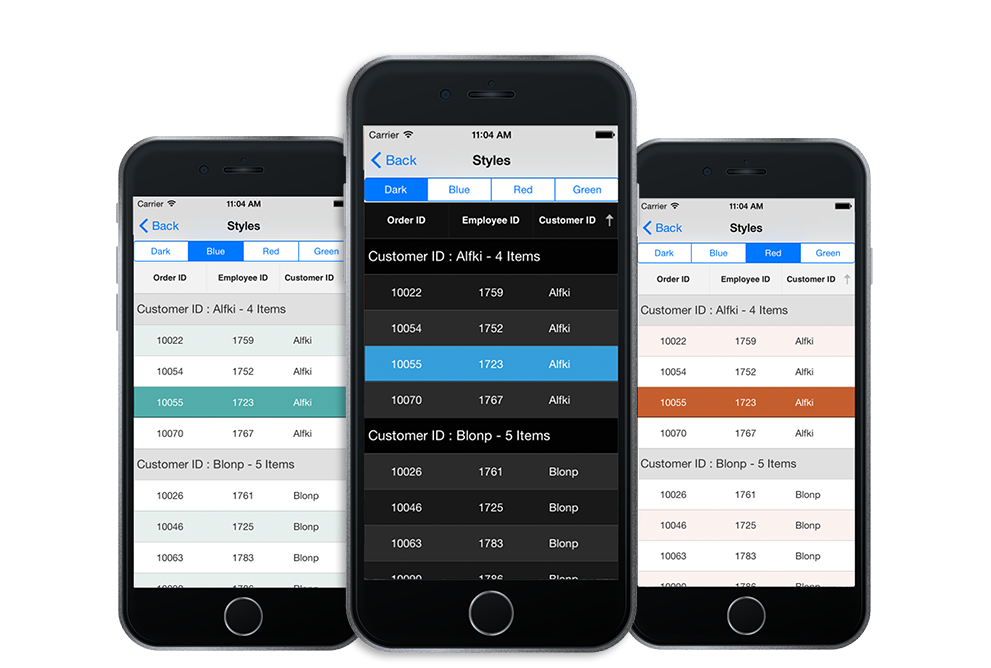
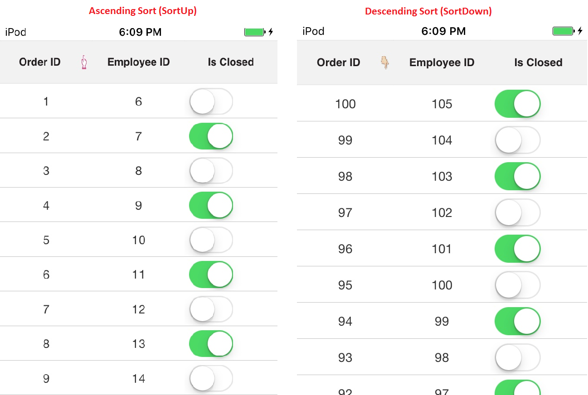

# Styles

SfDataGrid allows you to apply style to all of its elements by writing a Style class overriding from [DataGridStyle](http://help.syncfusion.com/cr/cref_files/xamarin-ios/sfdatagrid/Syncfusion.SfDataGrid.iOS~Syncfusion.SfDataGrid.DataGridStyle.html) and assigning it to the [SfDataGrid.GridStyle](http://help.syncfusion.com/cr/cref_files/xamarin-ios/sfdatagrid/Syncfusion.SfDataGrid.iOS~Syncfusion.SfDataGrid.SfDataGrid~GridStyle.html) property.
  
The following example explains you how to apply custom style to SfDataGrid.


//Apply custom style to SfDataGrid from code
dataGrid.GridStyle = new Dark ();



//Custom style class
public class Dark : DataGridStyle
{
    public Dark()
    {
    }

    public override UIColor GetHeaderBackgroundColor()
    {
        return UIColor.FromRGB(15, 15, 15);
    }

    public override UIColor GetHeaderForegroundColor()
    {
        return UIColor.FromRGB(255, 255, 255);
    }

    public override UIColor GetRecordBackgroundColor()
    {
        return UIColor.FromRGB(43, 43, 43);
    }

    public override UIColor GetRecordForegroundColor()
    {
        return UIColor.FromRGB(255, 255, 255);
    }

    public override UIColor GetSelectionBackgroundColor()
    {
        return UIColor.FromRGB(42, 159, 214);
    }

    public override UIColor GetSelectionForegroundColor()
    {
        return UIColor.FromRGB(255, 255, 255);
    }

    public override UIColor GetCaptionSummaryRowBackgroundColor()
    {
        return UIColor.FromRGB(02, 02, 02);
    }

    public override UIColor GetCaptionSummaryRowForeGroundColor()
    {
        return UIColor.FromRGB(255, 255, 255);
    }

    public override UIColor GetBordercolor()
    {
        return UIColor.FromRGB(81, 83, 82);
    }

    public override UIColor GetLoadMoreViewBackgroundColor()
    {
        return UIColor.FromRGB(242, 242, 242);
    }

    public override UIColor GetLoadMoreViewForegroundColor()
    {
        return UIColor.FromRGB(34, 31, 31);
    }

    public override UIColor GetAlternatingRowBackgroundColor()
    {
        return UIColor.Cyan;
    }

}


The following picture shows the grid loaded in different styles.

## Border Customization

* SfDatagrid allows you to customize the grid borders to vertical, horizontal, both or none based on requirements. Override the [DataGridStyle.GetGridLinesVisibility](http://help.syncfusion.com/cr/cref_files/xamarin-ios/sfdatagrid/Syncfusion.SfDataGrid.iOS~Syncfusion.SfDataGrid.DataGridStyle~GetGridLinesVisibility.html) method to customize the borders in SfDataGrid.


//Apply custom style to SfDataGrid from code
dataGrid.GridStyle = new CustomStyle ();

 

//Custom Style class 
public class CustomStyle : DataGridStyle
{
    public CustomStyle ()
    {
    }
    public override GridLinesVisibility GetGridLinesVisibility()
    {
        return base.GetGridLinesVisibility();
    }
}


Following are the lists of options available to customize the grid borders.

* [Both](http://help.syncfusion.com/cr/cref_files/xamarin-ios/sfdatagrid/Syncfusion.SfDataGrid.iOS~Syncfusion.SfDataGrid.GridLinesVisibility.html)
* [Horizontal](http://help.syncfusion.com/cr/cref_files/xamarin-ios/sfdatagrid/Syncfusion.SfDataGrid.iOS~Syncfusion.SfDataGrid.GridLinesVisibility.html)
* [Vertical](http://help.syncfusion.com/cr/cref_files/xamarin-ios/sfdatagrid/Syncfusion.SfDataGrid.iOS~Syncfusion.SfDataGrid.GridLinesVisibility.html)
* [None](http://help.syncfusion.com/cr/cref_files/xamarin-ios/sfdatagrid/Syncfusion.SfDataGrid.iOS~Syncfusion.SfDataGrid.GridLinesVisibility.html)

### Both

*  `GridLinesVisibility.Both` allows you to display the DataGrid with both Horizontal and Vertical borders.

public override GridLinesVisibility GetGridLinesVisibility()
{
    return GridLinesVisibility.Both;
}


The following screenshot shows the final outcome upon execution of the above code.

### Horizontal

* `GridLinesVisibility.Horizontal` allows you to display the DataGrid with Horizontal border only

public override GridLinesVisibility GetGridLinesVisibility()
{
    return GridLinesVisibility.Horizontal;
}


The following screenshot shows the final outcome upon execution of the above code.

### Vertical

* `GridLinesVisibility.Vertical` allows you to display the DataGrid with Vertical border only

public override GridLinesVisibility GetGridLinesVisibility()
{
    return GridLinesVisibility.Vertical;
}


The following screenshot shows the final outcome upon execution of the above code.

### None

* `GridLinesVisibility.None` allows you to display the DataGrid without borders

public override GridLinesVisibility GetGridLinesVisibility()
{
    return GridLinesVisibility.None;
}


The following screenshot shows the final outcome upon execution of the above code.

## How to

### Change the Sorting Icon in column headers

You can load any desired image as the sort icon in the SfDataGrid using the GetHeaderSortIndicatorDown and GetHeaderSortIndicatorUp overrides of the `DataGridStyle` class. The following code example illustrates how to change the SortIcon in SfDataGrid.



//Apply custom style to SfDataGrid from code
dataGrid.GridStyle = new Custom();

public class Custom : DataGridStyle
{

    public override UIImage GetHeaderSortIndicatorUp()
    {
        return UIImage.FromFile("SortDown.png");
    }

    public override UIImage GetHeaderSortIndicatorDown()
    {
        return UIImage.FromFile("SortUp.png");
    }

}


The following screenshots shows the final outcome of the above code

N> The image's BuildAction must be set to BundleResource so that we can access the image via its name.

### Change the color of the resizing indicator

You can change the color of the resizing indicator using the GetResizingIndicatorColor override of the `DataGridStyle` class. The following code example illustrates how to change the color of the ResizingIndicator in SfDataGrid. 



//Apply custom style to SfDataGrid from code
dataGrid.GridStyle = new Custom();

public class Custom : DataGridStyle
{
    public override UIColor GetResizingIndicatorColor()
    {
        return UIColor.Blue;
    }
}
