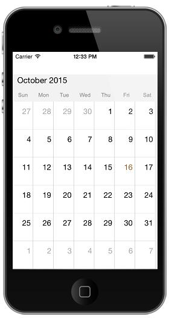
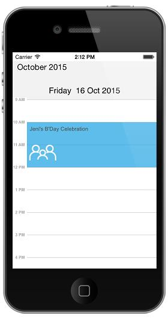

# Appearance & Styling 

## Month Cell Customization

Schedule views are designed as per the native calendar control with some enriched user interface for the control interaction and usability. Month view cell contains the date along with its appointments if available. There is an option available in Schedule control to change the default UI of Month View cell. By adopting `<SFScheduleDelegate>` protocol.

You can customize the MonthView in two ways, 

* MonthViewCellStyle property.
* didMonthcellLoaded event.

**Using MonthViewCellStyle property**

MonthView can be customized by setting monthViewCellStyle properties such as TextColor,TextStyle,BackgroundColor to the `MonthViewCellStyle` property of schedule.


    
    SFMonthCellStyle monthCellStyle = new SFMonthCellStyle();
    monthCellStyle.BackgroundColor = UIColor.Gray;
	monthCellStyle.TextColor = UIColor.Blue;
	monthCellStyle.TextStyle = UIFont.SystemFontOfSize(12);
	schedule.MonthCellStyle = monthCellStyle;
	


**Using MonthCellLoaded Event**

You can customize the month view during runtime using `didMonthcellLoaded Event`. In OnMonthCellLoaded event, the properties such as cellStyle,appointments,date,view and boolean properties such as isToday,isPreviousMonthDate,isNextMonthDate,isBlackOutDate are passed in the `MonthCellLoaded`.

Month cells can be customized using the `CellStyle` property in `monthCellLoaded` as follows,



    public ScheduleViews ()
    {
    SFSchedule schedule= new SFSchedule ();
    schedule.ScheduleView = SFScheduleView.SFScheduleViewMonth;
    schedule.Delegate = new ScheduleDelegate ();
    this.AddSubview (schedule);
    this.control = this;
    }
    
    public class ScheduleDelegate : SFScheduleDelegate
    {
        public override void didMonthcellLoaded(SFMonthCellLoaded monthCellLoaded)
	    {
		    if (monthCellLoaded.IsToday)
			{
			    //setting Month Cell style properties
				monthCellLoaded.CellStyle.BackgroundColor = UIColor.Gray;
				monthCellLoaded.CellStyle.TextColor = UIColor.Blue;
				monthCellLoaded.CellStyle.TextStyle = UIFont.SystemFontOfSize(12);
			}
	    }
	}



You can also add an object in the month cell view using `View` property passed through `MonthCellLoaded`.


    
    public class ScheduleDelegate : SFScheduleDelegate
    {
        public override void didMonthcellLoaded(SFMonthCellLoaded monthCellLoaded)
	    {
	        UIButton button = new UIButton();
	        button.BackgroundColor = UIColor.Green;
	        monthCellLoaded.View = button;
	    }
	}
	


## Appointment Customization.

`ScheduleAppointment` created in schedule are arranged based on its duration, where the appointments viewed through day, week and work week view are positioned in the timeslots. Default UI of the appointments in day, week and work week view can be changed by adopting `<SFScheduleDelegate>` protocol.

You can customize the Schedule Appointments in two ways.

* AppointmentStyle property.
* AppointmentLoadedEvent.

**Using AppointmentStyle property**

Schedule Appointment can be customized by setting appointmentstyle properties such as TextColor,TextStyle,BorderColor,BorderCornerRadius,BorderWidth,SelectionBorderColor,SelectionTextColor to the `SFAppointmentStyle` property of schedule.


    
    SFAppointmentStyle appointmentStyle = new SFAppointmentStyle();
	appointmentStyle.TextColor = UIColor.Red;
	appointmentStyle.TextStyle = UIFont.SystemFontOfSize(15);
	appointmentStyle.BorderColor = UIColor.Blue;
	appointmentStyle.BorderCornerRadius = 12;
	appointmentStyle.BorderWidth = 10;
	appointmentStyle.SelectionBorderColor = UIColor.Yellow;
	appointmentStyle.SelectionTextColor = UIColor.Yellow;
	schedule.AppointmentStyle = appointmentStyle;
	


You can customize the appointment view during runtime using `didAppointmentLoaded Event`.In OnAppointmentLoaded event, the properties such as appointmentStyle,appointment,view,Bounds are passed in the `SFAppointmentLoaded`.

ScheduleAppointment can be customized using the `AppointmentStyle` property in `appointmentLoaded`.



    public ScheduleViews ()
        {
            SFSchedule schedule= new SFSchedule ();
            schedule.ScheduleView = SFScheduleView.SFScheduleViewDay;
            schedule.Delegate = new ScheduleDelegate ();
            this.AddSubview (schedule);
            this.control = this;
        }
        
    public class ScheduleDelegate : SFScheduleDelegate
    {
    public override void didAppointmentLoaded(SFAppointmentLoaded appointmentLoaded)
        {
        appointmentLoaded.AppointmentStyle.TextColor = UIColor.Red;
        appointmentLoaded.AppointmentStyle.TextStyle = UIFont.SystemFontOfSize(15);
        appointmentLoaded.AppointmentStyle.BorderColor = UIColor.Blue;
        appointmentLoaded.AppointmentStyle.BorderCornerRadius = 12;
        appointmentLoaded.AppointmentStyle.BorderWidth = 10;
        appointmentLoaded.AppointmentStyle.SelectionBorderColor = UIColor.Yellow;
        appointmentLoaded.AppointmentStyle.SelectionTextColor = UIColor.Yellow;
	    }
	}
        

You can also add an object in the month cell view using `View` property passed through `SFAppointmentLoaded`.


    
    public class ScheduleDelegate : SFScheduleDelegate
    {
         public override void didAppointmentLoaded(SFAppointmentLoaded appointmentLoaded)
        {
	        UIButton button = new UIButton();
	        button.BackgroundColor = UIColor.Green;
	        appointmentLoaded.View = button;
	    }
	}
	


## Panel Customization

### Custom Day View

#### Date Time Formating

You can differentiate the timeslot panel using `VerticalLineColor` and `VerticalLineStrokeWidth` properties of `WorkWeekViewSettings`.



    //creating new instance for schedule
    SFSchedule schedule = new SFSchedule();
        
    //setting schedule view
    schedule.ScheduleView = SFScheduleView.SFScheduleViewDay;
        
    //setting day view settings properties
    DayViewSettings dayViewSettings = new DayViewSettings();
    dayViewSettings.VerticalLineColor = UIColor.Green;
    dayViewSettings.VerticalLineStrokeWidth = 5;
    schedule.DayViewSettings = dayViewSettings;
        
    this.AddSubview (schedule);
    this.control = this;



#### Working Hours 

You can differentiate working hours with non-working hour timeslots by its color using `NonWorkingHoursTimeSlotBorderColor`, `NonWorkingHoursTimeSlotColor`, `TimeSlotColor`,`TimeSlotBorderColor` and `TimeSlotBorderStrokeWidth` properties of `DayViewSettings`.


    
    //creating new instance for schedule
    SFSchedule schedule = new SFSchedule();
        
    //setting schedule view
    schedule.ScheduleView = SFScheduleView.SFScheduleViewDay;
    
    //setting day view settings properties
	DayViewSettings dayViewSettings = new DayViewSettings();
	dayViewSettings.NonWorkingHoursTimeSlotBorderColor = UIColor.Gray;
	dayViewSettings.NonWorkingHoursTimeSlotColor = UIColor.DarkGray;
	dayViewSettings.TimeSlotColor = UIColor.Yellow;
	dayViewSettings.TimeSlotBorderColor = UIColor.Blue;
	dayViewSettings.TimeSlotBorderStrokeWidth = 5;
	schedule.DayViewSettings = dayViewSettings;
    
    this.AddSubview (schedule);
    this.control = this;
            


#### All Day Appointments Panel

You can change the all day appointment panel color using the property `AllDayAppointmentBackgroundColor` of `DayViewSettings`.



    //creating new instance for schedule
    SFSchedule schedule = new SFSchedule();
        
    //setting schedule view
    schedule.ScheduleView = SFScheduleView.SFScheduleViewDay;
            
    //setting day view settings properties
    DayViewSettings dayViewSettings = new DayViewSettings();
    dayViewSettings.AllDayAppointmentBackgroundColor = UIColor.Purple;
    schedule.DayViewSettings=dayViewSettings;
            
    this.AddSubview (schedule);
    this.control = this;



### Custom Week View

#### Date Time Formating

You can differentiate the timeslot panel using `VerticalLineColor` and `VerticalLineStrokeWidth` properties of `WeekViewSettings`.



    //creating new instance for schedule
    SFSchedule schedule = new SFSchedule();
        
    //setting schedule view
    schedule.ScheduleView = SFScheduleView.SFScheduleViewWeek;
    
	WeekViewSettings weekViewSettings = new WeekViewSettings();
	weekViewSettings.VerticalLineColor = UIColor.Green;
	weekViewSettings.VerticalLineStrokeWidth = 5;
	schedule.WeekViewSettings = weekViewSettings;
	
    this.AddSubview (schedule);
    this.control = this;



#### Working Hours 

You can differentiate working hours with non-working hour timeslots by its color using `NonWorkingHoursTimeSlotBorderColor`, `NonWorkingHoursTimeSlotColor`, `TimeSlotColor`,`TimeSlotBorderColor` and `TimeSlotBorderStrokeWidth` properties of `WeekViewSettings`.



    //creating new instance for schedule
    SFSchedule schedule = new SFSchedule();
        
    //setting schedule view
    schedule.ScheduleView = SFScheduleView.SFScheduleViewWeek;
    
    //setting week view settings properties
	WeekViewSettings weekViewSettings = new WeekViewSettings();
	weekViewSettings.NonWorkingHoursTimeSlotBorderColor = UIColor.Gray;
	weekViewSettings.NonWorkingHoursTimeSlotColor = UIColor.DarkGray;
	weekViewSettings.TimeSlotBorderColor = UIColor.Blue;
	weekViewSettings.TimeSlotColor = UIColor.Yellow;
	weekViewSettings.TimeSlotBorderStrokeWidth = 5;
	schedule.WeekViewSettings = weekViewSettings;
    
    this.AddSubview (schedule);
    this.control = this;



#### All Day Appointments Panel

You can change the all day appointment panel color using the property `AllDayAppointmentBackgroundColor` of `WeekViewSettings`.



    //creating new instance for schedule
    SFSchedule schedule = new SFSchedule();
        
    //setting schedule view
    schedule.ScheduleView = SFScheduleView.SFScheduleViewWeek;

    //setting week view settings properties
    WeekViewSettings weekViewSettings = new WeekViewSettings();
    weekViewSettings.AllDayAppointmentBackgroundColor = UIColor.Purple;
    schedule.WeekViewSettings = weekViewSettings;
    
    this.AddSubview (schedule);
    this.control = this;



### Custom Work Week View

#### Date Time Formating

You can differentiate the timeslot panel using `VerticalLineColor` and `VerticalLineStrokeWidth` properties of `WorkWeekViewSettings`.



    //creating new instance for schedule
    SFSchedule schedule = new SFSchedule();
        
    //setting schedule view
    schedule.ScheduleView = SFScheduleView.SFScheduleViewWorkWeek;
    
    WorkWeekViewSettings workWeekViewSettings = new WorkWeekViewSettings ();
    workWeekViewSettings.VerticalLineColor = UIColor.Green;
    workWeekViewSettings.VerticalLineStrokeWidth = 5;
    schedule.WorkWeekViewSettings = workWeekViewSettings;
            
    this.AddSubview (schedule);
    this.control = this;



#### Working Hours 

You can also differentiate working hours with non-working hour timeslots by its color using `NonWorkingHoursTimeSlotBorderColor`, `NonWorkingHoursTimeSlotColor`, `TimeSlotColor`,`TimeSlotBorderColor` and `TimeSlotBorderStrokeWidth` properties of `WorkWeekViewSettings`.



    //creating new instance for schedule
    SFSchedule schedule = new SFSchedule();
        
    //setting schedule view
    schedule.ScheduleView = SFScheduleView.SFScheduleViewWorkWeek;

    //setting workweek view settings properties
    WorkWeekViewSettings workWeekViewSettings = new WorkWeekViewSettings();
	workWeekViewSettings.NonWorkingHoursTimeSlotBorderColor = UIColor.Gray;
	workWeekViewSettings.NonWorkingHoursTimeSlotColor = UIColor.DarkGray;
	workWeekViewSettings.TimeSlotBorderColor = UIColor.Blue;
	workWeekViewSettings.TimeSlotColor = UIColor.Yellow;
	workWeekViewSettings.TimeSlotBorderStrokeWidth = 5;
	schedule.WorkWeekViewSettings = workWeekViewSettings;
    
    this.AddSubview (schedule);
    this.control = this;



#### All Day Appointments Panel

You can change the all day appointment panel color using the property `AllDayAppointmentBackgroundColor` of `WorkWeekViewSettings`.



    //creating new instance for schedule
    SFSchedule schedule = new SFSchedule();
        
    //setting schedule view
    schedule.ScheduleView = SFScheduleView.SFScheduleViewWorkWeek;

    //setting workweek view settings properties
    WorkWeekViewSettings workWeekViewSettings = new WorkWeekViewSettings();
    workWeekViewSettings.AllDayAppointmentBackgroundColor = UIColor.Purple;
    schedule.WorkWeekViewSettings = workWeekViewSettings;
            
    // Set our view from the "main" layout resource
    this.AddSubview (schedule);
    this.control = this;



## Inline view Customization.

You can able to know the details of appointments in inline using `InlineAppointmentTapped` event in `Schedule`. Details of the selected  appointment and the corresponding date is passed through `InlineAppointmentTappedEventArgs` as `selectedAppointment` and `selectedDate` respectively.


    
    public ScheduleViews ()
    {
    SFSchedule schedule= new SFSchedule ();
    schedule.ScheduleView = SFScheduleView.SFScheduleViewMonth;
    schedule.Delegate = new ScheduleDelegate ();
    this.AddSubview (schedule);
    this.control = this;
    }
    
    public class ScheduleDelegate : SFScheduleDelegate
	{
		public override void didSelectInlineAppointment(SFSchedule schedule, NSDate selectedDate, ScheduleAppointment appointment)
		    {
				base.didSelectInlineAppointment(schedule, selectedDate, appointment);
			}
	}



