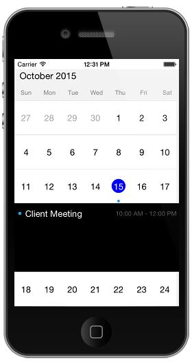
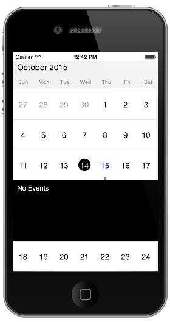
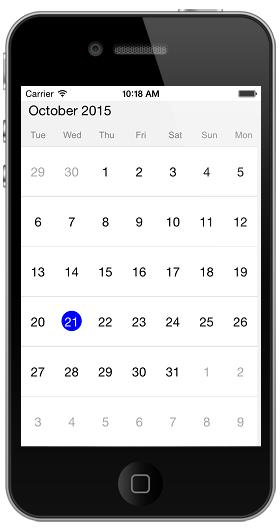

# Date Navigation and Gesture

## Forward

By default the date can be navigated to next view using touch gesture, by swiping the control in right to left direction. The view can be  also changed programmatically using `Forward()` method available in `SfSchedule`. So that next immediate visible dates will be viewed. It will move to next month if the schedule views is month, similarly it will move to next week for week view and next day for day view.



    //using schedule Forward()
    schedule.Forward();



>**NOTE** It can be navigated until it reaches the Min Max dates.

## Backward

By default the date can be navigated to previous view using touch gesture, by swiping the control in left to right direction. The view can be also changed programmatically using `Backward()` method available in `SfSchedule`. So that previous immediate visible dates will be displayed. It will move to previous month if the schedule views is month, similarly it will move to previous week for week view and previous day for day view.


   
    //using schedule Backward()
    schedule.Backward();



>**NOTE** It can be navigated until it reaches the Min Max dates.

## Move to Date 

Visible dates can be moved to specific date using `MoveToDate()` method available in `SfSchedule`. It will move to any specific date if the schedule view is Day View, similarly it will move to the specific week if it is week view and to specific month if it is month view.



    NSDate date = new NSDate ();
    NSCalendar calendar = NSCalendar.CurrentCalendar;
    // Get the year, month, day from the date
    NSDateComponents components = calendar.Components (
    NSCalendarUnit.Year | NSCalendarUnit.Month | NSCalendarUnit.Day, date);
    // Set the hour, minute, second
    components.Month=3;
    components.Hour = 10;
    components.Minute = 0;
    components.Second = 0;
    NSDate moveToDate = calendar.DateFromComponents (components);
    schedule.MoveToDate (moveToDate);



>**NOTE** The specified date should lies between `MinDisplayDate` and `MaxDisplayDate` , if  the specified date is greater than `MaxDisplayDate` then the view moved to `MaxDisplayDate` similarly if the specified date is lesser than the `MinDisplayDate` then the view moved to `MinDisplayDate`.

## Enable/disable navigation

By default Schedule views can be moved backwards and forwards using touch swipe gesture. This navigation, using touch gesture can be enabled and disabled using `EnableNavigation` property available in Schedule control. By default this is enabled.



    //disabling navigation gesture
    schedule.EnableNavigation = false;



## Min Max dates. 

Visible dates can be restricted between certain range of dates using `MinDisplayDate` and `MaxDisplayDate` properties available in Schedule control. It is applicable in all the schedule views.

So that beyond the min max date range, it will restrict date navigations features of `Forward()`, `Backward()`, `MoveToDate()` and also can’t swipe the control using touch gesture beyond the min max date range. Also, beyond the min max date range, selection will also not works for month view. So that tapped listeners while tapped on the month cell will not be listened. Thus Inline feature in month view will works only within the min max date range.



    SFSchedule schedule= new SFSchedule ();
    schedule.ScheduleView = SFScheduleView.SFScheduleViewMonth;
    schedule.MonthViewSettings.ShowAppointmentsInline = true;
    NSDate today = new NSDate ();

    NSMutableArray appCollection = new NSMutableArray ();
    NSCalendar calendar = NSCalendar.CurrentCalendar;
    // Get the year, month, day from the date
    NSDateComponents components = calendar.Components (
    NSCalendarUnit.Year | NSCalendarUnit.Month | NSCalendarUnit.Day, today);
    // Set the hour, minute, second
    components.Month=3;
    components.Hour = 10;
    components.Minute = 0;
    components.Second = 0;

    // Get the year, month, day from the date
    NSDateComponents endDateComponents = calendar.Components (NSCalendarUnit.Year | NSCalendarUnit.Month-1 | NSCalendarUnit.Day, today);
    // Set the hour, minute, second
    endDateComponents.Year=2015;
    endDateComponents.Month = 11;
    endDateComponents.Hour = 12;
    endDateComponents.Minute = 0;
    endDateComponents.Second = 0;

    NSDate maxDate = calendar.DateFromComponents (components);
    NSDate minDate = calendar.DateFromComponents (endDateComponents);

    schedule.MinDisplayDate = minDate;
    schedule.MaxDisplayDate = maxDate;

    this.AddSubview (schedule);
    this.control = this;



## Inline

By enabling Inline feature in month view, while touch the month view cell, appointments available in a particular day will be listed in inline view.



    schedule.MonthViewSettings.ShowAppointmentsInline = true;
    


## FirstDay of the Week

By default schedule control will be rendered with Sunday as the first day of the week, it can be customized to any day of the week by `FirstDayOfWeek` property of `SfSchedule`.



    schedule.ScheduleView = SFScheduleView.SFScheduleViewMonth;
    schedule.Calendar.FirstWeekDay =3;
    


