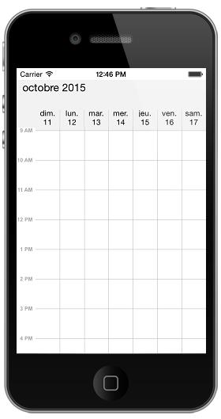

# Localization & Globalization

Schedule control is available with complete localization support . 

Localization can be specified by setting the `Locale` property of the control. In the format of `Language code` followed by `Country code`.  Based on the locale specified the strings in the control such as Date, time, days are localized accordingly.

By default schedule control is available with `en-US` locale. 

As the subject of the appointments are given in the application level, it can be set as localized strings as per the requirement. To know more about settings the subject refer `ScheduleAppointment`.



    schedule.Locale =  new NSLocale("fr-FR");



## Schedule Custom String Localization

Schedule has a built-in support for localizing the Custom Strings in it by specifying the corresponding string’s key and value in the `Localizable.strings` in the application. For an example in schedule there is a string `No Events` in Schedule Month View Inline. To localize the string, specify the key (“No Events”) and assign the corresponding localized string to it in `Localizable.strings` file. Please refer the following code for French language.

Schedule search for the key in corresponding language `Localizable.strings` file and displays the corresponding string in the schedule.
