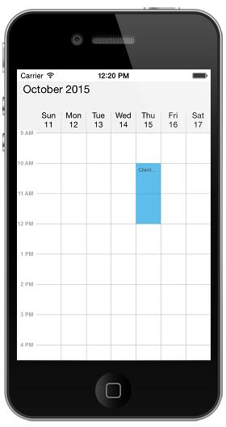

# Populating Appointments 

Schedule control has an inbuilt capability to handle the appointment arrangement internally based on the ScheduleAppointment collections. ScheduleAppointment is a class, which holds the details about the appointment to be rendered in schedule. Schedule Appointments collection can be provided to schedule using the following method.

## Adding appointments using Collection

ScheduleAppointment has some basic properties such as StartTime, EndTime, Subject and some  additional information about the appointment can be added using Color, Notes, Location, All Day, Recursive properties.

Create the collection of the ScheduleAppointments by setting required details using above mentioned properties for each appointment. And then assign the created collection to the `Appointment` property of `SfSchedule` as like in below code example.



    SFSchedule schedule= new SFSchedule ();
    schedule.ScheduleView = SFScheduleView.SFScheduleViewWeek;
    NSDate today = new NSDate ();
    NSMutableArray appCollection = new NSMutableArray ();
    NSCalendar calendar = NSCalendar.CurrentCalendar;
    // Get the year, month, day from the date
    NSDateComponents components = calendar.Components (
    NSCalendarUnit.Year | NSCalendarUnit.Month | NSCalendarUnit.Day, today);
    // Set the hour, minute, second
    components.Hour = 10;
    components.Minute = 0;
    components.Second = 0;

    // Get the year, month, day from the date
    NSDateComponents endDateComponents = calendar.Components (NSCalendarUnit.Year | NSCalendarUnit.Month | NSCalendarUnit.Day, today);
    // Set the hour, minute, second
    endDateComponents.Hour = 12;
    endDateComponents.Minute = 0;
    endDateComponents.Second = 0;
    NSDate startDate = calendar.DateFromComponents (components);
    NSDate endDate = calendar.DateFromComponents (endDateComponents);

    ScheduleAppointment appointment = new ScheduleAppointment ();
    appointment.StartTime = startDate;
    appointment.EndTime = endDate;
    components.Day = components.Day + 1;
    endDateComponents.Day = endDateComponents.Day + 1;
    appointment.Subject = (NSString)"Client Meeting";
    appointment.AppointmentBackground = UIColor.Red;
    appCollection.Add (appointment);
    schedule.Appointments = appCollection;
    this.AddSubview (schedule);
    this.control = this;



## Adding appointments by implementing data source protocol

The appointment can also be added to schedule control on demand based on the visible dates. This can be achieved by implementing the SFScheduleDataSource protocol in your application.

Before implementing the data source, you need to assign “dataSource” property of the schedule with the instance of an object where it is going to be implemented.

The data source protocol contains two methods as follows:

* schedule:appointmentsFromDate: Returns an appointments that is within the start and end visible date range.
* schedule:appointmentsForDate: Returns a appointments that is in the specific date. There is also an optional method.

By implementing the above two methods the appointments can be set to based on visible date range.



    SFSchedule schedule= new SFSchedule ();
    schedule.ScheduleView = SFScheduleView.SFScheduleViewWeek;
    NSDate today = new NSDate ();
    NSMutableArray appCollection = new NSMutableArray ();
    NSCalendar calendar = NSCalendar.CurrentCalendar;

    // Get the year, month, day from the date
    NSDateComponents components = calendar.Components (
    NSCalendarUnit.Year | NSCalendarUnit.Month | NSCalendarUnit.Day, today);

    // Set the hour, minute, second
    components.Hour = 10;
    components.Minute = 0;
    components.Second = 0;
    // Get the year, month, day from the date
    NSDateComponents endDateComponents = calendar.Components (NSCalendarUnit.Year | NSCalendarUnit.Month | NSCalendarUnit.Day, today);
    // Set the hour, minute, second
    endDateComponents.Hour = 12;
    endDateComponents.Minute = 0;
    endDateComponents.Second = 0;
    NSDate startDate = calendar.DateFromComponents (components);
    NSDate endDate = calendar.DateFromComponents (endDateComponents);

    ScheduleAppointment appointment = new ScheduleAppointment ();
    appointment.StartTime = startDate;
    appointment.EndTime = endDate;
    components.Day = components.Day + 1;
    endDateComponents.Day = endDateComponents.Day + 1;
    appointment.Subject = (NSString)"Client Meeting";
    appointment.AppointmentBackground = UIColor.Red;
   
    //Adding Appointment Collection 
    appCollection.Add (appointment);
    schedule.Appointments = appCollection;

    this.AddSubview (schedule);
    this.control = this;



