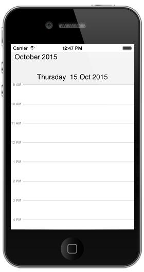
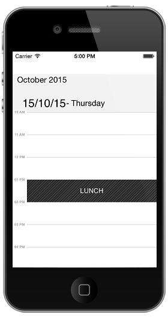
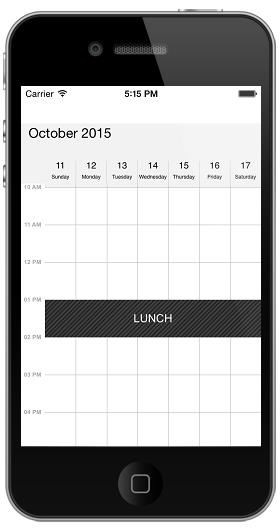
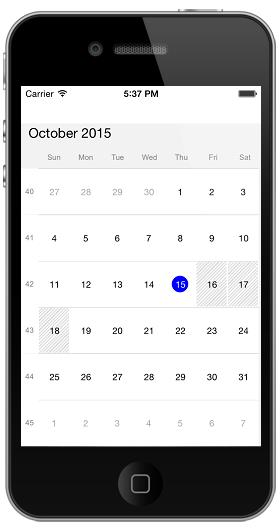

# Views

Schedule control provides four different types of views to display dates. Day view, Week view, WorkWeek view and Month view. It can be assigned to the schedule control by using `ScheduleView` property. Based on the user’s preference appointments can be viewed in any of the four type of view available. By default schedule control is assigned with day view.

## Day View

Day view is used to display a single day; current day will be visible by default. Appointments on a specific day will be arranged in respective timeslots based on its duration.



    schedule.ScheduleView = SFScheduleView.SFScheduleViewDay;



### Settings

#### Date Time Formating

You can format the date and time string in the schedule control using `DayLabelSettings` of `DayViewSettings` and the size of those strings are also customizable.

#### Non-Accessible Blocks

You can restrict/allocate certain timeslot as Non-accessible block using `NonAccessibleBlocks` of `DayViewSettings`, so that you can allocate those timeslots for predefined events/activities like Lunch hour.

#### Working Hours

You can differentiate working hours with non-working hour timeslots by its color using `WorkStartHour` and `WorkEndHour` properties of `DayViewSettings`.

#### All Day Appointments Panel

You can view All day appointments in separate panel and the panels visibility can be enabled by setting `ShowAllDay` property of `DayViewSettings` as true. 



    SFSchedule schedule= new SFSchedule ();
    schedule.ScheduleView = SFScheduleView.SFScheduleViewDay;

    DayViewSettings daySettings = new DayViewSettings ();

    daySettings.WorkStartHour=8;
    daySettings.WorkEndHour = 18; 

    //Non-AccessbleBlocks
    NonAccessibleBlock lunch_hour = new NonAccessibleBlock ();
    lunch_hour.StartHour = 13;
    lunch_hour.EndHour = 14;
    lunch_hour.Text = (NSString)"LUNCH";
    daySettings.NonAccessibleBlockCollection.Add (lunch_hour);

    DayLabelSettings labelSettings= new DayLabelSettings();
    labelSettings.TimeLabelSize =  8;
    labelSettings.DateLabelSize = 25;
    labelSettings.DateLabelFormat = (NSString)"dd/MM/yy";
    labelSettings.DayLabelFormat = (NSString)" - EEEE";
    labelSettings.TimeLabelFormat =(NSString) "hh a";

    daySettings.LabelSettings= labelSettings;
    schedule.DayViewSettings = daySettings;

    this.AddSubview (schedule);
    this.control = this;



## Week View

To view all the seven days of a particular week, by default if will be current week.Appointments arranged in timeslots based on its duration with respective day of the week.



    schedule.ScheduleView = SFScheduleView.SFScheduleViewWeek;



### Settings

#### Date Time Formating

You can format the date and time string in the schedule control using `WeekLabelSettings` of `WeekViewSettings` and the size of those strings are also customizable.

#### Non-Accessible Blocks

You can restrict/allocate certain timeslot as Non-accessible block using `NonAccessibleBlocks` of `WeekViewSettings`, so that you can allocate those timeslots for predefined events/activities like Lunch hour.

#### Working Hours

You can differentiate working hours with non-working hour timeslots by its color using `WorkStartHour` and  `WorkEndHour`  properties of `WeekViewSettings`.

#### All Day Appointments Panel

You can view All day appointments in separate panel and the panels visibility can be enabled by setting `ShowAllDay` property of `WeekViewSettings` as true.



    SFSchedule schedule= new SFSchedule ();
    schedule.ScheduleView = SFScheduleView.SFScheduleViewWeek;
    WeekViewSettings weekSettings = new WeekViewSettings ();
    weekSettings.WorkStartHour=8;
    weekSettings.WorkEndHour = 18; 
    //Non-AccessbleBlocks
    NonAccessibleBlock lunch_hour = new NonAccessibleBlock ();
    lunch_hour.StartHour = 13;
    lunch_hour.EndHour = 14;
    lunch_hour.Text = (NSString)"LUNCH";
    weekSettings.NonAccessibleBlockCollection.Add (lunch_hour);

    WeekLabelSettings labelSettings= new WeekLabelSettings();
    labelSettings.TimeLabelSize =  8;
    labelSettings.DateLabelSize = 20;
    labelSettings.DateLabelFormat = (NSString)"dd";
    labelSettings.DayLabelFormat = (NSString)"eee";
    labelSettings.TimeLabelFormat =(NSString) "hh a";
    weekSettings.LabelSettings= labelSettings;
    schedule.WeekViewSettings = weekSettings;
    this.AddSubview (schedule);
    this.control = this;



## Work Week View

To view working days of a particular week, by default current work week will be displayed. Saturday and Sunday are the non-working days by default; it can be customized with any days in a week. Appointments arranged in timeslots based on its duration with respective day of the week.



    schedule.ScheduleView = SFScheduleView.SFScheduleViewWorkWeek;



### Settings

#### Date Time Formating

You can format the date and time string in the schedule control using `WorkWeekLabelSettings` of  `WorkWeekViewSettings` and the size of those strings are also customizable.

#### Non-Accessible Blocks

You can restrict/allocate certain timeslot as Non-accessible block using `NonAccessibleBlocks` of `WorkWeekViewSettings`, so that you can allocate those timeslots for predefined events/activities like Lunch hour.

#### Working Hours

You can differentiate working hours with non-working hour timeslots by its color using `WorkStartHour` and  `WorkEndHour` properties of `WorkWeekViewSettings`.

#### All Day Appointments Panel

You can view All day appointments in separate panel and the panels visibility can be enabled by setting `ShowAllDay` property of `WorkWeekViewSettings` as true. 



    SFSchedule schedule= new SFSchedule ();
    schedule.ScheduleView = SFScheduleView.SFScheduleViewWorkWeek;
    WorkWeekViewSettings workWeekSettings = new WorkWeekViewSettings ();
    workWeekSettings.WorkStartHour=8;
    workWeekSettings.WorkEndHour = 18; 
    //Non-AccessbleBlocks
    NonAccessibleBlock lunch_hour = new NonAccessibleBlock ();
    lunch_hour.StartHour = 13;
    lunch_hour.EndHour = 14;
    lunch_hour.Text = (NSString)"LUNCH";
    workWeekSettings.NonAccessibleBlockCollection.Add (lunch_hour);
    WorkWeekLabelSettings labelSettings= new WorkWeekLabelSettings();
    labelSettings.TimeLabelSize =  8;
    labelSettings.DateLabelSize = 20;
    labelSettings.DayLabelSize = 5;
    labelSettings.DateLabelFormat = (NSString)"dd";
    labelSettings.DayLabelFormat = (NSString)"eee";
    labelSettings.TimeLabelFormat =(NSString) "hh a";
    workWeekSettings.LabelSettings= labelSettings;
    schedule.WorkWeekViewSettings = workWeekSettings;
    this.AddSubview (schedule);
    this.control = this;



## Month View

To view entire dates of a particular month, by default current month will be displayed initially. Appointments arranged within the cell based on its duration. Current date is differentiated by some color and rest of the dates in a month will be in different color., Also the color differentiation for dates will be applicable for previous and next month dates.



    schedule.ScheduleView = SFScheduleView.SFScheduleViewMonth;



### Settings

#### Date Time Formating

You can format the date and time string in the schedule control using `MonthLabelSettings` of  `MonthViewSettings` and the size of those strings are also customizable.

#### Blackout dates

You can restrict/allocate certain month cell as blackout days using `BlackoutDates` of `MonthViewSettings`, so that we can allocate those cells for predefined events/activities like Scheduled maintenance, planned leave etc.

#### Week number

You display the week number of the year in month view by setting `ShowWeekNumber` property of `MonthViewSettings` are true. By default it is false.

#### Visible AppointmentCount

You can customize the number of appointments to be rendered inside a month view cell using `VisibleCellAppointmentsCount` property of `MonthViewSettings`.



    SFSchedule schedule= new SFSchedule ();
    schedule.ScheduleView = SFScheduleView.SFScheduleViewMonth;
    NSDate today = new NSDate ();
    NSCalendar calendar = NSCalendar.CurrentCalendar;
    // Get the year, month, day from the date
    NSDateComponents components = calendar.Components (
    NSCalendarUnit.Year | NSCalendarUnit.Month | NSCalendarUnit.Day, today);
    MonthViewSettings monthViewSettings = new MonthViewSettings ();
    monthViewSettings.ShowWeekNumber = true;
    monthViewSettings.ShowAppointmentsInline = true;
    monthViewSettings.BlackoutDates = new NSMutableArray ();
    components.Day -= 3;
    for (int i = 0; i < 3; i++) {
    NSDate startDate = calendar.DateFromComponents (components);
    components.Day += 1;
    monthViewSettings.BlackoutDates.Add (startDate);
    }

    MonthLabelSettings labelSettings =  new MonthLabelSettings();
    labelSettings.DayLabelSize = 10;
    labelSettings.DayLabelFormat = (NSString)"EEEE";
    labelSettings.DateLabelFormat = (NSString)"d";
    labelSettings.DateLabelSize =  12;

    monthViewSettings.LabelSettings = labelSettings;
    schedule.MonthViewSettings = monthViewSettings;
    this.AddSubview (schedule);
    this.control = this;



